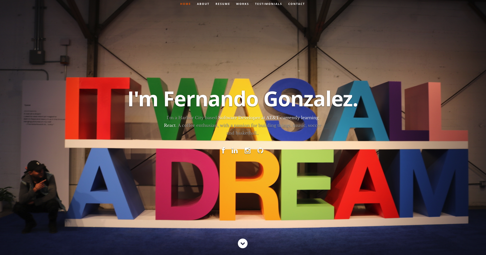

# React Portfolio Template

## <a href="https://lucid-swanson-ca04a3.netlify.app/">LIVE DEMO</a>

## Build Status

## Description

This is a React based personal resume website template.

## Make it Your Own!

#### PREREQUISITES:

- Sign up for a Netlify account <a href='https://www.netlify.com'>HERE</a>
- Install Node JS in your computer <a href='https://nodejs.org/en/'>HERE</a>

#### PROCEDURE:

- Download the zip folder from Github and unzip it
- Edit <code>public/resumeData.json</code> and add your personal details and projects
- RUN <code>npm init</code> , this command can be used to set up a new or existing npm package
- RUN <code>npm install</code> , this command pulls out all the require node modules
- RUN <code>npm run build</code>, this command will create a build folder for you
- DRAG AND DROP the BUILD folder on Netlify, your app is live now for the world to see

#### ADVANCE

- If docker is install you can simple run by running `$ make up-docker`
- Default to running on port 1951 -> localhost:1951
- To change port run `export HTTP_PORT=####`

## Credits

#### All Credits Goes to Tim Baker <a href='https://github.com/tbakerx/react-resume-template'>Original Repo</a>

HTML Design Template
<a href="https://www.styleshout.com/free-templates/ceevee/">Ceevee Template by Styleshout</a>

Header photo credit
<a href="https://unsplash.com/@mischievous_penguins?utm_medium=referral&amp;utm_campaign=photographer-credit&amp;utm_content=creditBadge">Casey Horner</a>

Testimonial photo credit
<a href="https://unsplash.com/@samuelzeller?utm_medium=referral&amp;utm_campaign=photographer-credit&amp;utm_content=creditBadge">Samuel Zeller</a>
